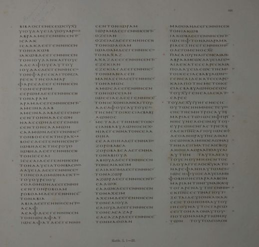

# ÉVANGILES SYNOPTIQUES

### L'enseignant

Thomas FRUCHART, laïc, enseignant en mathématiques et informatique au lycée St Paul Bourdon Blanc.

Débutant en enseignement biblique au séminaire !

### Objectifs du cours

* lecture **méthodique** des évangiles

* **spécificité** de chacun des évangiles synoptiques sur les plans littéraire et théologique.

* quelques réflexions sur les questions historiques au sujet de Jésus, et de l'histoire de la rédaction des évangiles

### Modalités pratiques

* un dépôt avec le contenu projeté en cours

  * [github.com/thfruchart/snde](github.com/thfruchart/snde)

  * alléger la prise de note

  * complément d'information, approfondissement..

* Ce cours présente les évangiles de Mt, Mc, Lc sur **2 ans**  (14 séances par semestre sur 2 semestres)

  * l'année **A** présente :

    * la question synoptique = relation entre les 3 évangiles de Mt, Mc, Lc, hypothèses sur l'histoire de leur rédaction...

    * une étude de l'évangile de Marc

  * l'année **B** présente plus en détail :

    * Matthieu

    * Luc.

* Validations :

  * en 1ère année : un écrit (questions de cours, et analyse d'un passage évangélique non préparé à l'avance)

  * en 2ème année : un oral sur un texte synoptique préparé à l'avance.

### Bref résumé de l'année A  :

* Entre la vie publique de Jésus et la mise par écrit des évangiles, quelques dizaines d'années se sont écoulées

  * 30 : mort de Jésus

  * (peu avant) 70 : Mc

  * 80 : Mt, Lc

  * 90 : Jn

* Avant d'être ÉCRIT, l'évangile a été prêché

* Mt et Lc utilisent très probablement **deux sources** qu'ils ont en commun

  * Marc
  * un recueil de paroles de Jésus (nommé source **Q**)

* En  70 de notre ère, le temple de Jérusalem est détruit par les Romains

  * il ne sera jamais reconstruit
  * Israël doit se ré-organiser sans Temple, sans sacrifices...
  * naissance du judaïsme rabbinique,  restructuré autour de la Torah.

> Matthieu est témoin d'une séparation de plus en plus nette entre judaïsme messianique et judaïsme rabbinique : quand il fait référence à ce dernier , il parle toujours de "leurs" synagogues. (A. MELLO, _Evangile selon saint Matthieu_, p.44)

* le contexte dans lequel écrivent les évangélistes n'est plus celui de la vie publique de Jésus, et chaque évangéliste est marqué par son propre contexte. Ainsi par exemple, les adversaires de Jésus sont :

  * chez Marc : les scribes sadducéens du Temple

  * chez Matthieu : les "scribes et pharisiens qui siègent dans la chaire de Moïse" (23,2)

# L'évangile selon Matthieu

Dans l'ensemble Mt suit Mc, mais...

Les premiers chapitres, qui relatent les origines de Jésus, n'ont pas de parallèle en Mc.

### 5 grands discours rythment Mt

1. discours sur la montagne : Mt 5-7

2. discours missionnaire : Mt 10

3. discours en paraboles : Mt 13 // Mc 4

4. discours communautaire : Mt 18

5. discours eschatologique : Mt 24-25 // Mc 13

Chacun de ces discours se termine par une formule stéréoptypée: "lorsque Jésus eut achevé ces paroles..."

Ces discours permettent-ils d'établir un plan de l'évangile ? Ce n'est pas évident !

Mais on peut dire que Mt donne la parole à Jésus pour de  longs discours qui édifient le lecteur, pour une communauté de disciples qui pourraient être déroutés par le texte de Mc qui n'offre pas vraiment d'exhortation, d'instruction...

Le lecteur de Mt bénéficie de l'enseignement du rabbin véritable, à savoir le messie !

### Un midrash de Marc ?

Un peu de vocabulaire :

- un *targoum* est une traduction libre d'un passage biblique (hébreu => araméen)

- un *midrash* est une sorte de commentaire, qui se présente comme une réécriture du texte qu'on souhaite commenter. On ne distingue pas le texte d'un côté, et le commentaire de l'autre. On réécrit de le texte avec des techniques variées (voir ci-dessous).

  - La bible hébraïque connaît un exemple de *midrash* : les Chroniques sont une réécriture des livres de Samuel et des Rois.
* Matthieu utilise des techniques "midrashiques" à partir du texte de Mc

  * transcription : 606 des 661 versets de Marc sont conservés par Mt

  * ommission : le jeune homme vêtu d'un simple drap qui s'enfuit nu lors de l'arrestation de Jésus

  * abréviation : de nombreux récits de miracles sont "résumés" (moins de personnages secondaires, focalisation sur Jésus...)

  * duplication : "à celui qui a, il sera donné" (Mt 13,12  + 25,29) ou "les derniers seront les premiers" (Mt 19,30 + 20,16)

  * glose : "quiconque répudie sa femme, ***sauf en cas d'impudicité***, et en épouse une autre commet un adultère" (Mt 10,11)

  * expansion : les 5 grands discours !

* on dit de Mt que c'est le plus juif des 4 évangiles : on peut dire que c'est une réécriture de Mc à la manière d'un *midrash*.

### L'évangile de l'église ?

Certaines spécificites de Mt ont fait qu'on le qualifie parfois d'évangile de l'église :

* discours missionnaire
* discours communautaire
* le mot "église" figure  :
  * 23 fois en Ac
  * 62 fois dans les épitres attribuées à Paul
  * 0 fois chez Mc, Lc, Jn
  * 2 fois chez Mt
    * Mt 16,18 : "tu es Pierre et sur cette pierre je bâtirai mon église, et la puissance de la Mort ne l'emportera pas sur elle"
    * Mt 18,17 : "que toute l'affaire soit réglée sur la parole de deux ou trois témoins. S'il refuse de les écouter, dis-le à l'église"
* Attention : ne pas trop vite opposer "l'église" à "Israël". Cette interprétation a pu être proposée, mais le texte de Mt ne construit pas une telle opposition : beaucoup de choses qui sont valables pour Israël restent valables pour la communauté de Mt.

### 7 séances sur Mt

1. Enfance (Mt 1-2)

2. Jean-Baptiste et Jésus (Mt 3-4)

3. Jésus et la Torah (Mt 5-7)

4. Activité messianique (Mt 8-9)

5. Le fils de David à Jérusalem (Mt 21-23)

6. La venue du fils de l'homme (Mt 24-25)

7. Passion et résurrection (Mt 26-28)

Objectif de chaque séance : s'exercer à une lecture méthodique pour en comprendre les enjeux !

# La genèse du Messie

Avant toute chose : lire Mt 1-2

## délimitation du passage ?

Mt 1-2 forme-t-il une (vaste) unité ?

Mt 3 débute avec :

* une mention de temps (imprécise) : "en ces jours là"

* un nouveau personnage : Jean le Baptiste

* une nouvelle indication de lieu : "désert de Judée".

Une nouvelle unité commence en Mt 3,1

Mt 1 - 2 présente "les origines de Jésus", selon une traduction possible du premier verset du livre.

## traduction ?

Mt 1,1

* Βίβλος γενέσεως Ἰησοῦ χριστοῦ υἱοῦ Δαυὶδ υἱοῦ Ἀβραάμ.

* Livre de la genèse de Jésus Christ, fils de David, fils d’Abraham (BJ)

* Généalogie de Jésus, Christ, fils de David, fils d'Abraham. (Liturgie, NSB)

* Livres des origines de Jésus Christ, fils de David, fils d'Abraham (TOB)

Littéralement :

* Βίβλος => livre

* γένεσις => source, origine, naissance, voire existence

Le premier verset de Mt introduit :

* la généalogie qui suit immédiatement

* et/ou

* l'ensemble des deux premiers chapitres, inculant la généalogie et les événements entourant la naissance de Jésus.

## Vocabulaire ?

#### γένεσις

Mt 1,1 : titre de l'évangile: livre <mark>de l'origine</mark> de **Jésus Christ**

> Βίβλος <mark>γενέσεως</mark> **Ἰησοῦ χριστοῦ**

Mt 1,18 : "voici comment arriva la <mark>naissance</mark> de **Jésus Christ**"

>  Τοῦ δὲ **Ἰησοῦ χριστοῦ** ἡ <mark>γένεσις</mark> οὕτως ἦν.

La reprise du même vocabulaire au v. 18 correspond à une "nouvelle introduction" !

#### Βίβλος γενέσεως

on trouve le même vocabulaire en Gn 5,1

> 1 Voici le **livre de la généalogie** d’Adam. Le jour où Dieu créa les humains, il les fit à la ressemblance de Dieu. 2 Homme et femme il les créa, il les bénit et les appela du nom d’« humains » – Adam – le jour où ils furent créés.
>
> 3 Adam vécut cent trente ans, puis il engendra un fils à sa ressemblance, selon son image, et il l’appela du nom de Seth.
>
> 4 Les jours d’Adam, après qu’il eut engendré Seth, furent de huit cents ans ; il engendra des fils et des filles.
>
> 5 La totalité des jours qu’Adam vécut fut de neuf cent trente ans ; puis il mourut.
>
> 6 Seth vécut cent cinq ans, puis il engendra Enosh.
>
> 7 Après la naissance d’Enosh, Seth vécut huit cent sept ans ; il engendra des fils et des filles.
>
> 8 La totalité des jours de Seth fut de neuf cent douze ans ; puis il mourut.
>
> 9 Enosh vécut quatre-vingt-dix ans, puis il engendra Caïnân.

* "généalogie" d'Adam : plutôt la liste des descendants d'Adam

* ce genre littéraire est utilisé à plusieurs reprise dans la livre de la Genèse (style sacerdotal)

  * Gn 10 : descendance de Noé

  * Gn 11,10 : descendance de Sem (jusqu'à Abraham)

  * Gn 25,19 : descendance d'Isaac

  * Gn 36,9 : descendance d'Esaü

* la particularité de Gn 5,1 est l'expression "livre de la genèse"... mais en Mt 1, on a une "généalogie" au sens classique (liste des ascendants).

#### "fils de David"

Cette expression est utilisée 10 fois en Mt.

* en Mt 1,20  l'ange s'adresse à Joseph en l'appelant "fils de David" (= descendant de David)

* Souvent, des gens s'adressent directement à Jésus en l'appelant "fils de David" (aveugles en Mt 20,30)

* on considère que l'expression a un sens messianique : ceci se vérifie dans l'AT, et dans Mt !

  > Mt22, 41-42
  >
  > Comme les pharisiens étaient rassemblés, Jésus leur posa cette question :
  >
  > Que pensez-vous du Christ ? De qui est-il le fils ?
  >
  > Ils lui répondirent : De David.

#### "fils d'Abraham"

Pourquoi Mt ajoute-t-il "Fils d'Abraham" après "Fils de David" ?

- certes, ce n'est pas faux... mais n'est-ce pas une évidence ?
* le nom "Abraham"" fait transition avec la suite du texte.

* contrairement à "fils de David", "fils d'Abraham" n'est pas un titre messianique... il sert plutôt à désigner les membres de l'Alliance

  > Mt 3, 9
  >
  > ne pensez pas pouvoir dire : « Nous avons Abraham pour père ! »
  >
  > Car je vous dis que de ces pierres Dieu peut susciter des enfants à Abraham.

* "fils de David"... est-ce suffisant pour présenter Jésus ? Cette expression est peut-être ambiguë (un peu trop glorieux ?) Il faut lire la suite pour mieux répondre à cette question.

* Le premier verset suggère que certes Jésus est messie Fils de David... mais d'une manière particulière

  * dans la fidélité à la promesse faite aux pères...

  * dans la condition d'un "simple" fils d'Abraham

## Chercher une structure du passage : Mt 1-2

#### Dans la grande unité de Mt 1-2 : combien de petites unités de sens ?

1. Mt 1,1-17 : généalogie

2. Mt 1,18-25 : annonce à Joseph

3. Mt 2,1-12 : les mages

4. Mt 2,13-23 : fuite en Égypte

   * massacre des innocents : Mt 2,16-18

#### Personnages

Dans le chap 1 le personnage le plus souvent nommé est David (5 fois)

Dans le chap 2 :

* Jésus est nommé 1 fois

* Joseph 4 fois

* Hérode est nommé 9 fois

* "L'enfant" est nommé 9 fois

#### lieux

* Où se passe le chap 1 ?

  * pas de mention de lieu à part Babylone (qui est un lieu associé à un temps : celui de l'Exil)

* Où se passe le chap 2 ?

  * Bethléem (v. 1, 5, 6, 8, 16)

  * Jérusalem (v. 1, 3)

  * Égypte (v. 13, 14, 15, 19) => rappel de l'Exode

  * Gallilée (v. 22)

  * Nazareth (v. 23)

Il y a une unité du premier chapitre autour de la question : d'où vient Jésus ? au sens : de qui Jésus est-il le fils ?

Il y a une unité du deuxième chapitre autour de la question : d'où vient Jésus ? au sens géographique ! Il y a une symbolique géographique qui oppose :

* Jérusalem et Bethléem

* la Judée et la Gallilée

* L'Égypte au royaume d'Hérode

## Relation à l'Ancien Testament ?

### Citations d'accomplissement

* Typique du style de Mt : il est l'évangile qui cite le plus l'AT

  * une quarantaine de citations, et une trentaine d'allusions

  * dont une dizaine de citations d'accomplissement introduites par une formule stéréotypée : "afin que s’accomplisse ce qui avait été dit par l’entremise du/des prophète(s)" (avec de petites variations parfois significatives)

  * il y a 5 "citations d'accomplissement" dans Mt 1-2

* il faut analyser chaque citation en détail, mais quelques remarques peuvent déjà être faites :

  * on s'imagine parfois que l'AT comme une sorte de réservoir de prophéties en attente de réalisation... mais...
    * "D'Égypte, j'ai appelé mon Fils" :

      est-ce vraiment une annonce prophétique?
    * Le texte est au passé et se réfère clairement au peuple d'Israël : "Quand Israël était jeune, je l'ai aimé, et de l'Égypte j'ai appelé mon Fils"
    * le prophète (Osée) fait référence à l'Exode, à la libération d'Israël déjà réalisée à la sortie d'Égypte
    * En Mt, ce verset reçoit une interprétation nouvelle, plus "pleine" : les mots anciens ont été "remplis" avec un sens nouveau
    * littéralement, le verbe "accomplir" peut signifer remplir.
  * Les premières générations chrétiennes ont **relu** les Écritures à la lumière de Jésus, pour y **discerner** la manière dont il s'inscrit dans l'Alliance.
  * Le mouvement va dans les 2 sens :
    * ce sont les Écritures qui permettent de mieux comprendre comment ce qui se réalise en Jésus vient bien du Dieu de l'Alliance.
    * en Jésus, certaines paroles des prophètes trouvent une **plénitude** de sens.
  * certaines citations ne sont pas "exactes" :
    * il sera appelé nazoréen (Mt 2, 23) => ne correspond à aucun texte de l'AT
    * citation proposée par les scribes :

      > Mt 2,6  
      > 6 Et toi, Bethléem, terre de Juda, tu n’es pas la moindre parmi les principales villes de Juda, car de toi sortira un Chef qui doit paître Israël, mon peuple. 

      à comparer avec

      > Michée 5,1  
      > Et toi, Bethléem Ephrata, le plus petit des clans de Juda, de toi sortira pour moi celui qui doit gouverner Israël
* Matthieu, en bon scribe, tire du trésor de l'écriture "des choses neuves et anciennes" (Mt 13,52)

# La généalogie : Mt 1, 1-17

Ce type de texte ne passionne pas le lecteur moderne...

Mais Matthieu prend la peine d'ouvrir son évangile avec cette page particulière : nous allons donc prendre la peine de chercher ce qu'il souhaite signifier.

## Structure ?

1. Quels sont les éléments qui permettent de structurer le passage ?
* le v. 17 sert de "conclusion" et présente explicitement une structure

  >  Il y a donc en tout quatorze générations depuis Abraham jusqu’à David, quatorze générations depuis David jusqu’à la déportation à Babylone, quatorze générations depuis la déportation à Babylone jusqu’au Christ.

* la structure est donc chronologique : l'unité de mesure du temps étant ici la "génération"
2. Quels sont les éléments remarquables dans ces versets ?
* répétitions : A engendra B, B engendra C ...

  * exception  :  v. 16

    > Et Jacob engendra Joseph, l’époux de Marie, de laquelle est né Jésus, qu’on appelle Christ.

  * il n'est pas écrit : "Joseph engendra Jésus" !

  * il est fait mention du nom de la mère de l'enfant

* extensions : plusieurs femmes sont mentionnées dans cette généalogie qui suit la filiation paternelle.

  * Tamar (belle-fille de Juda)

  * Rahab (prostituée de Jéricho)

  * Ruth (la Moabite, belle-fille de Noémi)

  * la [femme] d'Urie (Bethsabée)

    * Bethsabée est la seule qui n'est pas désignée par son nom.

* la structure est discrètement marquée à la fin des versets 5, 11 et 16

  > Jessé engendra David **le roi**. (v.5)
  >
  > Josias engendra Jéchonias et ses frères, **au temps de la déportation à Babylone**. (v.11)
  >
  > Et Jacob engendra Joseph, l’époux de Marie, de laquelle est né Jésus, **qu’on appelle Christ**.

* le mot "Christ" est repris en conclusion au v. 17 : c'est un mot-clé du texte.

  * on retrouve au v. 17 le vocabulaire du v. 1

    > v. 1 : Christ, fils de David, fils d’Abraham
    >
    > v. 17 : Abraham ... David ... Christ

  * ces mots forment une **inclusion** qui marque le début et la fin de la généalogie.
