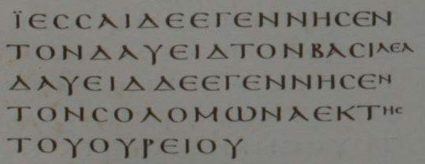

# La généalogie : Mt 1, 1-17

Ce type de texte ne passionne pas le lecteur moderne...

Mais Matthieu prend la peine d'ouvrir son évangile avec cette page particulière : nous allons donc prendre la peine de chercher ce qu'il souhaite signifier.

## Structure ?

1. Quels sont les éléments qui permettent de structurer le passage ?
* le v. 17 sert de "conclusion" et présente explicitement une structure
  
  >  Il y a donc en tout quatorze générations depuis Abraham jusqu’à David, quatorze générations depuis David jusqu’à la déportation à Babylone, quatorze générations depuis la déportation à Babylone jusqu’au Christ.

* la structure est donc chronologique : l'unité de mesure du temps étant ici la "génération"
2. Quels sont les éléments remarquables dans ces versets ?
* répétitions : A engendra B, B engendra C ...
  
  * exception  :  v. 16
    
    > Et Jacob engendra Joseph, l’époux de Marie, de laquelle est né Jésus, qu’on appelle Christ.
  
  * il n'est pas écrit : "Joseph engendra Jésus" !
  
  * il est fait mention du nom de la mère de l'enfant

* extensions : plusieurs femmes sont mentionnées dans cette généalogie qui suit la filiation paternelle.
  
  * Tamar (belle-fille de Juda)
  
  * Rahab (prostituée de Jéricho)
  
  * Ruth (la Moabite, belle-fille de Noémi)
  
  * la [femme] d'Urie (Bethsabée)
    
    * Bethsabée est la seule qui n'est pas désignée par son nom.

* la structure est discrètement marquée à la fin des versets 5, 11 et 16
  
  > Jessé engendra David **le roi**. (v.5)
  > 
  > Josias engendra Jéchonias et ses frères, **au temps de la déportation à Babylone**. (v.11)
  > 
  > Et Jacob engendra Joseph, l’époux de Marie, de laquelle est né Jésus, **qu’on appelle Christ**.

* le mot "Christ" est repris en conclusion au v. 17 : c'est un mot-clé du texte.
  
  * on retrouve au v. 17 le vocabulaire du v. 1
    
    > v. 1 : Christ, fils de David, fils d’Abraham
    > 
    > v. 17 : Abraham ... David ... Christ
  
  * ces mots forment une **inclusion** qui marque le début et la fin de la généalogie.
    
    #### quelques remarques :

* Mt ne présente pas les femmes mentionnées dans la généalogie.
  
  * Mt s'adresse probablement à des fidèles (juifs) qui sont familiers avec les écritures.

* La venue du messie Jésus est située dans l'histoire de l'Alliance depuis Abraham, avec ses hauts et ses bas !
  
  * en "haut" : David
  
  * en "bas" : l'Exil
  
  * enfin : le Messie

* l'extension du texte : Joseph => Marie => Jésus est en quelque sorte "préparée" par les extensions précédentes, qui ont toutes pour point commun une naissance qui sort de l'ordinaire.

## Passage parallèle : Luc 3,23-38

quelles ressemblances ? quelles différences ?

Certaines spécificités de Luc sont à noter :

* généalogie "ascendante"

* qui remonte jusqu'à "fils d'Adam, fils de Dieu"

* sans mentionner aucun nom de femme (pas même Marie)

* généalogies incompatibles
  
  > Nathan, fils de David (Lc 3, 31)
  
  * selon Lc, Jésus descend de David par Nathan
  
  * selon Mt, Jésus descend de David par Salomon
  
  * le nombre de générations entre David et Jésus est
    
    * 28 chez Mt
    
    * 42 chez Luc

Visées théologiques différentes

* Luc présente Jésus "fils de Dieu" car "fils d'Adam" :
  
  * un enjeu théologique concerne l'incarnation.
  
  * c'est  l'humanité (Adam) que Jésus vient "visiter". Cette "visite" concerne donc d'emblée tout être humain, juif ou pas !
  
  * on pense que les lecteurs de Luc sont nombreux à être "païens" (pagano-chrétiens)

* Matthieu présente Jésus "fils de l'Alliance" :
  
  * sa venue est située dans les périodes qui rythment l'histoire d'Israël
  
  * "fils de David" , "fils d'Abraham" : tout contribue à situer le Messie à l'intérieur d'Israël.
  
  * on pense que les lecteurs de Matthieu sont nombreux à être juifs (judéo-chrétiens)

### la délicate question de l'exactitude historique

Mt et  Lc ne peuvent pas donner tous les deux **la** généalogie **exacte** de Jésus (au plan légal) : il faut se faire à cette idée...

L'écriture d'une généalogie ne sert pas à "fournir l'état-civil de Jésus".

Pour nous, il importe d'accepter d'entendre ce que signifie chaque évangile, même si certaines informations du texte ne sont pas historiquement exactes !

Pour rappel... il y a **aussi** certaines informations **historiquement exactes** dans les évangiles (à commencer par la mort en croix !)

La **vérité** d'un passage évangélique (et biblique) ne se situe pas souvent au niveau de l'exactitude des faits historiques.

Dans la suite du cours, nous reviendrons ponctuellement sur les questions d'historicité, car l'étude des synoptiques (avec aussi Jn) joue un rôle important dans le travail historique sur Jésus !

### les femmes de la généalogie

#### femmes étrangères ?

* Rahab (païenne de Jéricho) [la bible de dit pas comment elle épouse Salmon]

* Ruth (la Moabite)

* Tamar ? (certaines traditions tardives en feraient une femme étrangère)

* Bethsabée ?
  
  * elle est israëlite
  
  * mariée à Urie (le Hittite)

Question : est-ce que Mt attend de son lecteur qu'il "complète" les noms propres qui font référence à des origines étrangères ?

* cela permettrait de comprendre pourquoi Bethsabée n'est pas nommée par son nom, mais par celui de son mari étranger.

#### interprétation

Même si Mt souligne la venue du Messie, fils d'Abraham, au sein du peuple d'Israël, il indique aussi que les nations étrangères sont concernées **aussi** par la venue du Messie.

On a donc chez Mt et chez Luc, par deux voies différentes, une conviction importante  : le Messie vient pour toute l'humanité !

#### la femme d'Urie

David engendra Salomon de la (femme) d'Urie.

* engendrer un enfant de la femme d'un autre s'appelle "adultère"...

* tout se passe comme si Mt soulignait l'adultère de David (en évoquant aussi le fait de commander la mort d'Urie)

* c'est dans le texte de la généalogie la seule action de "David le roi"
  
  > 2R17,21-23 : méditation sur la fin du Royaume d'Israël
  > 
  > Car Israël s’était détaché de la maison de David, et ils avaient établi roi Jéroboam, fils de Nabat ; et Jéroboam avait détourné Israël de Yahweh et leur avait fait commettre un grand péché.
  > Et **les enfants d’Israël marchèrent dans tous les péchés que Jéroboam avait commis** ; ils ne s’en détournèrent point,
  > jusqu’à ce que Yahweh eût chassé Israël loin de sa face, comme il l’avait dit par l’organe de tous ses serviteurs les prophètes. Et Israël fut emmené captif loin de son pays en Assyrie, où il est resté jusqu’à ce jour.

* on trouve dans les livres des Rois une méditation sur le rôle des rois... qui entraînent le peuple à pécher !

* la conséquence de tout ceci est l'Exil à Babylone.

* la royauté, même de David, est ambiguë => voir 1 Sa 8 discours de Samuel au peuple qui demande un roi.
  
  > Mt 22, 41- 44
  > 
  > Les Pharisiens étant assemblés, Jésus leur fit cette question :
  > « Que vous semble du Christ ? De qui est-il fils ? »
  > 
  > Ils lui répondirent : « De David. »
  > 
  > « — Comment donc, leur dit-il, **David** inspiré d’en haut **l’appelle**-t-il **Seigneur**, en disant :
  > Le Seigneur a dit à mon Seigneur : Assieds-toi à ma droite, jusqu’à ce que je fasse de tes ennemis l’escabeau de tes pieds ?»

* Le titre "fils de David" est bien sûr un titre royal :
  
  * mais ceci ne suffit pas à dire qui est le messie.
  
  * cela peut même induire en erreur.
  
  * certes le Messie est "fils de David", mais il est aussi "Seigneur de David"
  
  * n'allons pas imaginer que nous comprenons correctement et complètement, dès la première lecture, l'expression "fils de David" !

# L'annonce à Joseph

> Voici comment arriva la naissance de Jésus

Pourtant, Mt ne raconte PAS la naissance... Sur quoi met-il donc l'accent?

* remarquer l'expression "fils de David", adressée par l'ange à Joseph

* en nommant Jésus, Joseph l'inscrit dans la lignée davidique
  
  * noter les trois occurrences de l'expression hébraïsante *appeler le nom de*...
    
    > tu l'appelleras du nom de Jésus (v. 21)
    > 
    > on l'appellera du nom d'Emmanuel (v. 23)
    > 
    > un fils, qu'il appela du nom de Jésus (v. 25)

* il existe une possibilité de traduction et d'interprétation particulière du v. 20
  
  > ... n'aie pas peur de prendre chez toi Marie, ta femme, **car** ce qui a été engendré en elle est [l'oeuvre] de l'Esprit Saint. Elle enfantera un fils et tu appelleras son nom Jésus.
  > 
  > ... n'aie pas peur de prendre chez toi Marie, ta femme.  **Car, certes** ce qui a été engendré en elle est [l'oeuvre] de l'Esprit Saint, **mais** elle enfantera un fils et **tu** appelleras son nom Jésus.
  
  * cette traduction est possible, mais elle ne fait pas l'unanimité
  
  * dans ce cas, le message de l'Ange est d'inciter Joseph à assumer la paternité légale de Jésus **bien que** Jésus soit le fruit de l'Esprit Saint.
  
  * la "justice" de Joseph serait alors de vouloir s'effacer devant le mystère de cet enfant, mystère dont il aurait déjà conscience.

* Citation d'Isaïe
  
  * contexte dans le livre d'Isaïe :
    
    * Achaz, roi de Juda, tremble devant ses ennemis qui le menacent.
      
      > Is 7,16
      > avant que l’enfant sache rejeter le mal et choisir le bien, le pays dont tu redoutes les deux rois sera dévasté.
    
    * le texte hébreu parle de "la jeune fille", que le grec traduit "la vierge".
    
    * dans le contexte d'Isaïe, la "jeune fille" désigne la princesse royale.
    
    * oracle de naissance royale, qui sera le signe que le Seigneur délivre le roi de ses ennemis.

* Après la "citation d'accomplissement", Mt prend le soin de traduire le nom "Emmanuel" : Dieu avec nous.
  
  * la naissance miraculeuse est une chose importante, certes
  
  * mais Mt attire notre attention sur la signification du NOM
    
    > Mt 1,23
    > ce qui se traduit "Dieu avec nous".
    
    qu'on peut rapprocher de la finale du livre
    
    > Mt 28, 20
    > Et **moi**, je suis **avec vous**, tous les jours jusqu'à la fin du monde.
  
  * Dans la citation d'accomplissement, le nom "Emmanuel" affirme que Dieu est avec nous...
    
    -  A l'époque d'Achaz, le nom de l'enfant annoncé témoigne de la confiance que "Dieu est avec nous", mais l'enfant annoncé à Achaz par Isaïe n'était pas lui-même Dieu avec nous...! 
    
    - "ils l'appelleront Emmanuel" ou "on l'appellera" s'écarte du texte d'Isaïe...
    
    - en effet, Joseph ne nommera pas l'enfant du nom "Emmanuel
    
    - mais "Emmanuel" dit réellement quelque chose de QUI est cet enfant : il y a dans ce nom des choses "anciennes" et "nouvelles".

* Le nom de Jésus n'est pas "traduit", mais il est "expliqué" :
  
  > Jésus, car c'est lui qui sauvera son peuple de ses péchés
  
  * la bible de la liturge insère une parenthèse
    
    > Jésus, (c'est à dire, Le-Seigneur-sauve)
  
  * dans les paroles de l'ange, il faut remarquer que Jésus sauve le peuple **de ses péchés** (et non pas de ses *ennemis*, comme au temps d'Achaz)
    
    * à la différence d'un quelconque roi d'Israël, qui imite les péchés de Jéroboam, entraînant le peuple à pécher...
      
      Jésus sauve le peuple de ses péchés !
    
    * l'ange ne dit pas "En lui, Le Seigneur sauvera... " mais "c'est lui qui sauvera" !
      
      En tant que chrétiens, nous sommes trop habitués à entendre que Jésus nous sauve... mais "normalement", c'est *le Seigneur* qui sauve !
      
      Une expression chrétienne comme "Le Seigneur Jésus" nous empêche de remarquer l'audace de l'ange...
  
  * le nom de Jésus s'enrichit du contenu révélé par "Emmanuel"

# La visite des mages

Observer la manière dont Jésus est "appelé" :

* par les mages :
  
  * roi des Juifs

* ce qu'Hérode "traduit" par :
  
  * le Christ

* ce à quoi les grands prêtres et les scribes répondent par une citation :
  
  * un dirigeant (et non un roi, ni un Messie)
  
  * qui fera paître Israël mon peuple.
  
  * autrement dit... un BERGER !

* ceci évoque un passage célèbre de la vie de David
  
  > 1 Sa 16, 1.11.13a
  > Yahweh dit à Samuel : « [...] Remplis ta corne d’huile et va ; je t’envoie chez Jessé de **Béthléem**, car j’ai vu parmi ses fils **le roi que je veux**. »
  > 
  > Alors Samuel dit à Jessé : « Sont-ce là tous les jeunes gens ? » Il répondit : « Il y a encore le plus jeune, et voilà qu’il **fait paître** les brebis. »
  > 
  > Samuel, ayant pris la corne d’huile, **l’oignit** au milieu de ses frères...

* on peut penser aussi au combat contre Goliath
  
  > 1 Sa 17, 34-35
  > 
  > David dit à Saül : « Lorsque ton serviteur **faisait paître** les brebis de son père, et qu’un lion ou un ours venait et enlevait une brebis du troupeau,
  > je me mettais à sa poursuite, je le frappais et j’arrachais la brebis de sa gueule ;
  
  * David triomphe de Goliath en tant que berger, non pas avec les armes du roi, mais avec sa fronde !
  
  * le roi que veut le Seigneur soit plus berger que guerrier. Ce sera le "drame" de David installé à Jérusalem que de ne plus sortir au devant de ses hommes à la manière d'un berger, mais de les envoyer au loin, puisque tel est le pouvoir du "roi"...
  
  * Jésus sera "roi des Juifs" (comme le disent les mages), mais d'une manière complètement inattendue, et scandaleuse :
    
    > Mt 27, 37
    > 
    > Au-dessus de sa tête ils mirent un écriteau indiquant la cause de son supplice : « Celui-ci est Jésus, le roi des Juifs. »
  
  * Le paradoxe est que ce "roi des Juifs" sera reconnu davantage par des non-juifs (figurés par les mages) que par des juifs (figurés par les scribes).

# La fuite en Égypte

### le massacre des innocents

 On peut voir un parallèle avec le livre de l'Exode, et en particulier l'histoire de Moïse :

* Pharaon veut faire mourir les enfants des hébreux mais Moïse est sauvé // Hérode fait mourir les enfants de Bethléem, mais Jésus est sauvé

* Fuite de Moïse (hors d'Égypte) // fuite de la sainte famille (vers l'Égypte)

* il y a une forme d'ironie à ce que la terre qui fut celle de l'esclavage et de la domination de Pharaon devienne une terre de refuge pour échapper à Hérode.

* noter la formule d'introduction de la citation d'accomplissement :
  
  > Alors s'accomplit
  
  et non pas
  
  > afin que s'accomplisse
  
  le drame des pleurs de Rachel résulte de la cruauté d'Hérode. Ce drame est éclairé par le prophète Jérémie, mais il n'était pas "causé" par la parole de Jérémie.

* Dans le contexte du livre de Jérémie, les pleurs de Rachel évoquent le drame de l'Exil à Babylone. Mais la suite du texte affirme une espérance
  
  > Jr 31,15-17
  > 
  > Ainsi parle Yahweh : Une voix a été entendue à Rama, des lamentations et des pleurs amers : Rachel pleurant ses enfants ; elle refuse d’être consolée, sur ses enfants, parce qu’ils ne sont plus.
  > 
  > Ainsi parle Yahweh : Retiens ta voix de gémir, et tes yeux de pleurer. Car ton œuvre aura sa récompense, — oracle de Yahweh : ils reviendront du pays de l’ennemi.
  > Il y a de l’espérance pour tes derniers jours, — oracle de Yahweh, et tes enfants retourneront dans leurs frontières.

## fuite et retour d'Égypte

Remarquons que le verbe "appeler" figure dans les deux citations d'accomplissement qui concernent Jésus :

> Mt 2, 15
> D'Égypte, j'ai appelé mon fils.

> Osée 11,1-3  
> Quand Israël était jeune, je l’aimais : d’Egypte j’ai appelé mon fils.  
> Mais ils se sont éloignés de ceux qui les appelaient ; ils ont sacrifié aux Baals et offert de l’encens aux statues.  
> C’est moi qui ai guidé les pas d’Ephraïm, en le soutenant par les bras ; mais ils n’ont pas compris que je prenais soin d’eux.

Ce passage d'Osée se rapporte au PEUPLE comme fils, qui est "monté" d'Égypte à l'appel de Dieu.

Par opposition au peuple, qui n'a pas été fidèle à sa vocation de "fils" (voir le procès instruit par le prophète Osée), Jésus, en tant que vrai fils d'Abraham, va **accomplir** cette vocation. Cet accomplissement signifie : 

* des "choses anciennes" : 
  
  * Jésus refait le chemin qui a été celui du peuple, 
  
  * il reçoit un appel à vivre de la fidélité à laquelle Dieu appelait autrefois son peuple.

* des "choses nouvelles" : 
  
  * Jésus est fidèle
  
  * la suite de l'Évangile va manifester que Jésus EST fils en un sens absolument inédit.

> Mt 2, 23
> afin que s'accomplisse ce qui avait été dit par l'entremise des prophètes : il sera appelé nazoréen.

Notons que Mt doit "justifier" que Jésus ait grandi à Nazareth puisqu'il est né à Bethléem, et que tout indique que Joseph était (en bon descendant de David) habitant de Bethléem avant la fuite en Égypte ! 

> Jn 1,46 : "De Nazareth, peut-il sortir quelque chose de bon?") 

Mt relève le défi en affirmant que si Jésus vient "de Nazareth", c'est bien conformément à la volonté de Dieu !

Aucun texte de l'Ancien Testament ne correpond à cette "prophétie" (noter le flou : par l'entremise **des prophètes**). On ne sait pas à quels prophètes Mt se réfère...

Différentes pistes ont été proposées, notamment 

* *nazir* : "consacré", même si le mode de vie de Jésus ne correspond pas à celui d'un nazir... 

* *neçer* : "bourgeon"
  
  > Is 11,1  
  > Alors un rameau sortira du tronc de Jessé, et un rejeton (וְנֵ֖צֶר) de ses racines sera fécond.
  
  * Cet oracle fait partie du "livret de l'Emmanuel", déjà cité dans l'annonce à Joseph. 

Même si Jésus vient de Nazareth en Gallilée, c'est conformément à la volonté du Seigneur : une autre citation d'accomplissement ira dans ce sens en Mt 3.

# En conclusion

L'évangéliste écrit son évangile "à la manière juive", à partir de Marc notamment.

Il s'adresse à des disciples de Jésus qui connaissent bien les Écritures et qui sont restés juifs : d'où l'insistance sur le fait que le Messie vient accomplir l'histoire d'Israël.

Mt s'ouvre sur la présentation des origines de Jésus : non seulement le mystère de sa naissance, mais le mystère de son être, qui se lit en particulier dans la manière dont il est "appelé"" :

* fils de David :
  
  * mais plutôt à la manière de David Berger (Bethléem) que David roi (Jérusalem)
  
  * la suite de l'évangile révélera que Jésus est aussi Seigneur de David

* roi des Juifs
  
  * mais d'une manière tout autre que ce qu'Hérode imagine comme rival.
  * qui anticipe aussi la mort de Jésus en croix

* Jésus - Emmanuel
  
  * celui qui sauve son peuple de ses péchés
  * car il est lui-même Dieu avec nous.

Il est important d'analyser la manière dont le texte est construit pour "ouvrir les mots" et comprendre ce qu'ils signifient.
