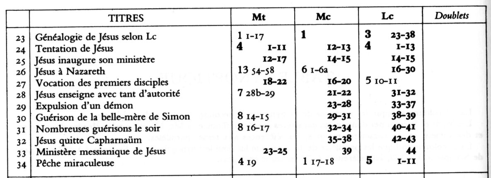

# Évangiles synoptiques

# Luc 4 : à la synagogue de Nazareth

### Lecture du texte

A l'aide des éléments de méthode (fiche), de la traduction proposée, et de l'extrait de synopse, proposer :

* une délimitation du passage

* une observation du contexte

* une structure pour le passage : "Jésus à la synagogue de Nazareth"

* un titre pour chaque "partie".

Pour justifier vos choix, il s'agit toujours d'argumenter à partir des observations du texte !

## Contexte

Globalement, Lc suit **Mc 1**, avec deux exceptions

* il ANTICIPE le discours de Jésus à la synogogue de Nazareth (// Mc **6**)

* il REPOUSSE l'appel des disciples de Mc1 jusqu'en Lc 5,10-11 (inséré dans la péricope de la "pêche miraculeuse").

> Lc 4,43 Mais il leur dit : Aux autres villes aussi, il me faut **annoncer la bonne nouvelle** (*εὐαγγελίσασθαί*) du règne de Dieu ; car c’est pour cela que j’ai été **envoyé** (*ἀπεστάλην*).

qu'on peut comparer avec

> Mc 1,38 Allons ailleurs, dans les bourgades voisines, afin que là aussi je ***proclame*** (*κηρύξω*) ; car c’est pour cela que je suis **sorti** (*ἐξῆλθον*).

Lc choisit de reprendre au v. 43 le vocabulaire d'Isaïe (v.18).

Ainsi, les guérisons et exorcismes sont à comprendre à la lumière de la parole de Jésus à la synagogue de Capharnaüm : il est venu pour libérer les opprimés, et proclamer une année d'accueil de la part du Seigneur.

Ceci peut expliquer le choix de Lc de "bousculer" la chronologie. En effet, il relate "tout ce qui s'est produit à Capharnaüm" (expression du v. 23) APRÈS le discours de Jésus qui y fait allusion !

Ce n'est pas une erreur : c'est une manière de mettre en avant l'INTERPRÉTATION que Jésus donne de ces événements, dans une double direction => reconnaissance ET rejet.

### Délimitation

v. 16 : verbe de déplacement + changement de lieu (Nazareth)

v. 31 : verbe de déplacement + changement de lieu (Capharnaüm)

Entre ce deux versets :

* unité de lieu (synagogue)

* unité de temps (sabbat)

* unité de personnages : Jésus et ceux qui sont dans la synagogues (qui ne sont pas nommés).

#### personnages

formellement, aucun personnage n'est nommé :

* il => Jésus

* ils => les personnes présentes à la synagogue

une seule exception : "le servant", mais ce personnage n'est le sujet d'aucun verbe... il est seulement là pour recevoir le livre.

### Vocabulaire

#### les verbes "parallèles" => construction

     il se leva
       il lui fut donné le livre
         il déroula
           et trouva la passage où il était écrit...
         il roula le livre
       le donna
     et s'assit

* Jésus est le sujet de tous les verbes

* structure qui met au centre le passage d'Isaïe

* ABSENCE du verbe LIRE ("pour faire la lecture")

Lorsque "les yeux de tous étaient fixés sur lui ":

* le texte n'a pas encore donné à entendre une parole de Jésus au style direct !

* au v.21, il **commença** à leur **dire** :

  * 1ère parole de Jésus au style direct dans ce passage

  * 1ère utilisation du verbe dire

#### le verbe "dire"

Dans la suite, le verbe **dire** est utilisé

* v.22 : "ils disaient : N'est-ce pas le fils de Joseph?"

* v.23 : "il leur dit"

  * "vous me direz"

* v. 24 : "il leur dit encore"

  * "Amen je vous le dit"

  * "En vérité, je vous le dis" (v.25)

Les paroles au style direct sont presque TOUTES prononcées par Jésus dans cette péricope : la seule exception est au v. 22

Dans le contenu des paroles au style direct, Jésus utilise l'expression "Amen je vous le dis", qui est pourtant RARE chez Luc. Occurrences en Mt-Mc-**Lc**-Jn=31-13-**6**-25.

Tout contribue à mettre l'accent sur les PAROLES de JÉSUS **après** la lecture, et donc sur son interprétation de cette Écriture... plus que sur la lecture elle-même.

#### le verbe "chasser"

    ils se levèrent
      le chassèrent
        et le menèrent ... afin de le précipiter

Trois verbes sont utilisés... donc le verbe chasser (ἐκβάλλω) qui est aussi utilisé dans la paraboles des "vignerons homicides"

> Lc 20 12 Il en envoya encore un troisième ; ils le blessèrent et le chassèrent.
>
> 15 Et ils le chassèrent hors de la vigne et le tuèrent.

=> allusion, à peine voilée, à la passion

* v. 12 : c'est un serviteur  qui est chassé => un prophète

* v. 15 : il s'agit du "fils bien-aimé"

Le rejet du FILS s'inscrit dans la droite ligne du rejet des prophètes qui l'ont précédé.

#### Aujourd'hui

- 8 fois en Mt

- 1 fois en Mc

- 11 fois en Lc

> Lc 2,11  **aujourd’hui**, dans la ville de David, il vous est né un sauveur, qui est le Christ, le Seigneur.

En Lc, c'est souvent l'aujourd'hui du salut qui est souligné.

### Rapport à l'AT

#### Citation d'Isaïe

> Lc 4, 18 L’Esprit du Seigneur est sur moi, parce qu’il m’a conféré l’onction pour annoncer la bonne nouvelle aux pauvres ; il m’a envoyé pour proclamer aux captifs la délivrance, et aux aveugles le retour à la vue, **pour renvoyer libres les opprimés** (ἀποστεῖλαι τεθραυσμένους ἐν ἀφέσει),
> 19 pour proclamer une année d’accueil de la part du Seigneur.

Composée d'Is 61,1-2 + 58,6b

> Is61,1  Le souffle du Seigneur Dieu est sur moi, car le Seigneur m’a conféré l’onction. Il m’a envoyé porter une bonne nouvelle aux pauvres, panser ceux qui ont le cœur brisé, proclamer aux captifs leur libération et aux prisonniers leur élargissement,
> 2 proclamer pour le Seigneur une année de faveur et pour notre Dieu un jour de vengeance ; consoler tous ceux qui sont dans le deuil
>
> Is 58,6  Le jeûne que je préconise, n’est-ce pas plutôt ceci : détacher les chaînes de la méchanceté, dénouer les liens du joug, **renvoyer libres  ceux qu’on écrase** (ἀπόστελλε τεθραυσμένους ἐν ἀφέσει), et rompre tout joug ?

Jésus n'a pas pu lire exactement ce texte à la synagogue... car le texte est composite !

Mais la technique juive dite *gezerah shawah* permet de rapprocher deux passages bibliques ayant des mots en commun (ici ἄφεσις) => Luc connaît cette technique, et il cite l'ensemble comme "passage où il est écrit..."

* **L'Esprit** est sur moi => Esprit prophétique (sens accessible à l'auditoire de Jésus)

* il m'a consacré par **l'onction** =>  messianique , accessible surtout au lecteur de Lc, qui peut faire mémoire

  * du "baptême"  de Jésus => manifestation de l'Esprit

  * de la nativité

  > Lc 2, 11  aujourd’hui, dans la ville de David, il vous est né un sauveur, qui est le **Christ**, le Seigneur.

#### Allusion à Élie et Élisée

> Si 48  
>
> 1Alors survint le prophète Élie, tel un feu.
>
> Sa parole brûlait, comme un flambeau.
> 2Il déclencha la famine en Israël.
>
> Il était si passionné pour le Seigneur, qu'il réduisit le peuple à peu de gens.
> 3Sur l'ordre du Seigneur, il retint la pluie
>
> et fit tomber trois fois le feu du haut des cieux.
>
> ...
> 9Tu as été enlevé au ciel dans un tourbillon de flammes,
>
> sur un char emporté par des chevaux de feu.
> 10Selon les Écritures, tu es prêt pour le jour où tu apaiseras
>
> la colère divine avant qu'elle n'éclate.
>
> Tu dois réconcilier le père avec son enfant et relever les tribus d'Israël.
> 11Heureux ceux qui te verront et ceux que l'amour de Dieu garde
>
> dans le sommeil de la mort !
>
> Nous aussi, nous revivrons sûrement !

Élie résume à lui seul toute l'histoire prophétique

* il renvoie au modèle de Moïse (passé)

* il est aussi attendu pour les derniers temps (futur)

La suite de Lc mettra en oeuvre une typologie, c'est à dire une manière de présenter Jésus en faisant mémoire d'Élie (ou Élisée) .

#### typologie

La typologie est une **interprétation figurative** qui associe

* un type (*figurant*)  par ex :  Élie

* un anti-type (*figuré*) par ex : Jésus

Ainsi, un personnage de l'AT est inteprété comme une figure qui trouve sa finalité en Christ, son but, son accomplissement.

Dans le NT, la typologie souligne l'orientation de l'histoire sainte comme histoire du SALUT.

### STRUCTURE

1. ECRITURE trouvée par Jésus Nazareth : v. 16-20

2. INTERPRÉTATION par Jésus, et réactions : v. 21-30
* positive : 21-22

  * parole de Jésus : v.21

  * réaction : v.22

* négative : 23-30

  * parole de Jésus : v.23-27

  * réaction : v.28-30

#### réaction positive

> Tous lui **rendaient témoignage**, **ils s'étonnaient** des **paroles de grâce** qui sortaient de sa bouche

* rendre témoignage => connotation très positive

* paroles de grâce

  * prononcées "par grâce" ?

  * au sujet de la "grâce" ?

  * les deux sens sont possibles, et tous deux connotés positivement

* "ils s'étonnaient" (ἐθαύμαζον)

  * la nuance du verbe est celle d'un émerveillement

  * connotation positive

> N’est-ce pas le fils de Joseph ?

Lc n'écrit pas (comme chez Marc) : "ils étaient choqués à son sujet".

Les auditeurs ont simplement réalisé le contraste entre leur connaissance humaine de Jésus, et ce qu'ils découvrent de lui en entendant des "paroles de grâce"

#### réaction négative

Elle est théâtrale : les notes des bibles expliquent que Luc "adapte" la situation géographique pour dramatiser son récit.

Le projet de mettre Jésus à mort annonce clairement la passion.

Le fait que Jésus échappe (v.30) est peut-être miraculeux (résurrection?) ou pas : reflet de l'autorité de Jésus, et transition avec la suite du texte.

Les commentateurs ont noté que cette double réaction (reconnaissance et rejet) structure la suite de l'évangile :

* Lc 5-9 : Jésus prophète reconnu

* Lc 10-19 : montée à Jérusalem => Jésus chemine vers la mort violente des prophètes

> Lc  13,34  Jérusalem, Jérusalem, toi qui tues les prophètes et qui lapides ceux qui te sont envoyés, combien de fois j’ai voulu rassembler tes enfants comme une poule rassemble sa couvée sous ses ailes ! Mais vous ne l’avez pas voulu.

#### tournant v.22-23

C'est Jésus lui-même qui semble provoquer le tournant d'une réaction positive, vers une réaction négative.

> aucun prophète n’est bien accueilli dans son pays // Mc - Mt

Cette parole de Jésus sur le rejet d'un prophète dans sa patrie est précédé, uniquement chez Lc, par une "mise en accusation".

Plutôt qu'une provocation, il convient d'interpréter cette parole comme une annonce prophétique :

les habitants de Nazareth n'ont pas le temps de refuse  Jésus, qu'il leur annonce déjà leur refus !

Jésus connaît d'avance sa mission, il sait à qui il a été envoyé, et il l'annonce à tous ceux qui viennent l'écouter en pensant être les "premiers" à en bénéficier.

=> Jésus fera preuve de la même liberté au v. 43

> Lc 4,43  Mais il leur dit : **Aux autres villes aussi**, il me faut annoncer la bonne nouvelle du règne de Dieu

### Aujourd'hui cette Écriture est accomplie à vos oreilles

- à vos oreilles

  - les auditeurs de Jésus doivent comprendre que Jésus se présente comme prophète
qui proclame
et qui libère

C'est à l'auditoire de Jésus (et au lecteur de Lc) de **reconnaître** qui est Jésus.

On peut comparer avec

> Lc 22,37  
> Car, je vous le dis, il faut que ce qui est écrit **s’accomplisse en moi** : Il a même été compté avec les sans-loi.
>
> Lc 24,44  
> il fallait que **s’accomplisse** tout ce qui est écrit **à mon sujet** dans la loi de Moïse, dans les Prophètes et dans les Psaumes.

Jésus procède de façon "oblique" : il n'affirme pas directement qu'il est le prophète!

#### En quoi consiste cet "accomplissement" ?

C'est la deuxième partie du texte qui permet de mieux la vocation **prophétique** de Jésus

Positivement :

* elle est universelle => ne se limite pas aux frontière d'Israël

Négativement :

* rejet  => car aucun prophète n'est bien accueilli chez lui

Le problème n'est pas de chercher pourquoi les habitants de Nazareth ont rejeté Jésus, il est plutôt de comprendre que le rejet dont Jésus est paradoxalement un signe d'authenticité de sa mission !

Après avoir été présenté comme MESSIE royal et FILS de Dieu dans les récits de l'enfance, il est étonnant que Jésus se présente "seulement" comme prophète, en ouvrant sa mission.

> J.-N. ALETTI, *L'Évangile selon St Luc*, p. 131 pour répondre à l'objection d'une mort ignominieuse de Jésus en croix, le narrateur devait montrer que son destin était entièrement celui des grands et vrais prophètes de l'AT.

Il faudra se souvenir du discours de Jésus à Nazareth en lisant les récits de la Passion!
